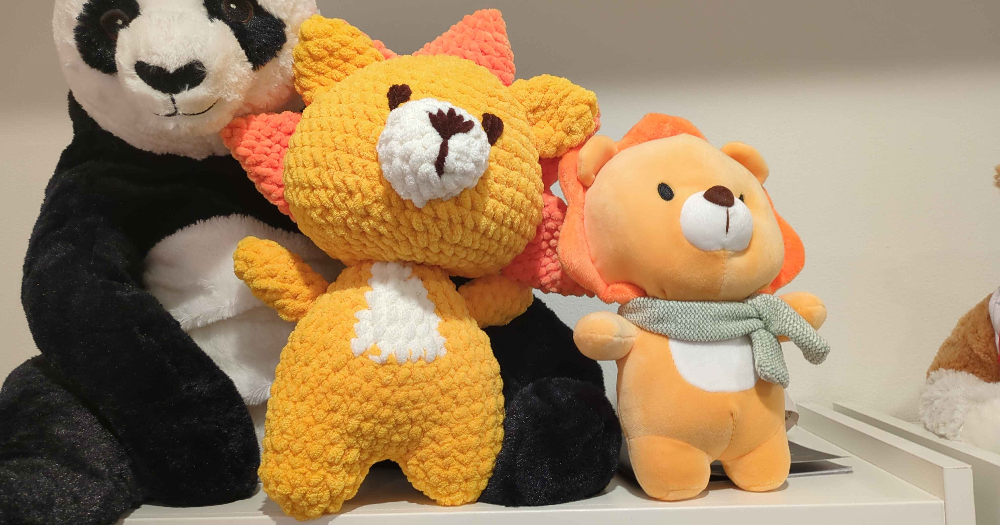

# lyon plush pattern

> use the "Contents" button above this to access the table of contents for this pattern!
{: .prompt-info }

merry christmas and happy holidays lyons!
this is the pattern for my lyon plushie contribution to the advent calender :3
this pattern is based off of the aliexpress lion plushie the guys used in some pobs during ticsl era.

> this pattern assumes you have novice/intermediate crochet experience, as well as experience reading crochet patterns!
{: .prompt-warning }

## credits

this pattern is heavily based off of [AmiSaigon's three part lion plush tutorial,](https://www.youtube.com/watch?v=L0TAjyKMh8s) as well as [Ami Amour's lion plush pattern](https://amiamour.com/crochet-lion-amigurumi-pattern-free/).
please consider supporting these creators if you're able to!

## materials

yarn, all in super bulky/size 6:
- yellow
- orange
- white/cream
- brown

(i used a mix of bernat blanket (yellow, cream) and premier parfait chunky (orange, brown))

notions:
- polyfill/stuffing alternative
- size H/5.0mm hook
- stitch markers
- embrodiery needle
- scissors

## abrreviations

(american english crochet, sorry europeans)

ch - chain

sc - single crochet

inc - two single crochet in one stich

sc2tog - single crochet 2 together (sc dec)

sl st - slip stitch

## pattern

### legs (make two)

start with yellow yarn

| round # | pattern            | total stitches |
| ------- | ------------------ | -------------- |
| R1      | 5 sc in magic ring | 5              |
| R2      | 5 inc              | 10             |
| R3      | (1 sc, inc) x 5    | 15             |
| R4      | 15 sc              | 15             |

tie off **one leg**, but not the other. the other leg will be used to crochet the legs together.

### body

start by slip stitching the two legs together using the yarn from the leg that wasn't tied off. 
the round will be completed by making a circle around the outside of the legs.
i suggest watching the AmiSaigon video for a visual reference if needed.

> the white tummy can either be cross stitched on, or you can color swap on one of the 5 sc blocks in round 7 of the body (opposite from the round-starting stitch). the white block should decrease naturally as sc2tog's are done in white. 
{: .prompt-info }

| round # | pattern                  | total stitches |
| ------- | ------------------------ | -------------- |
| R1      | (4 sc, inc) x 6          | 36             |
| R2-6    | 36 sc                    | 36             |
| R7      | (5 sc, sc2tog, 5 sc) x 3 | 33             |
| R8      | (9 sc, sc2tog) x 3       | 30             |
| R9      | (4 sc, sc2tog, 4 sc) x 3 | 27             |
| R10     | (7 sc, sc2tog) x 3       | 24             |
| R11     | (2 sc, sc2tog, 2 sc) x 4 | 20             |
| R12     | (3 sc, sc2tog) x 4       | 16             |

tie off, stuff well.

### head

start with yellow yarn

| round # | pattern            | total stitches |
| ------- | ------------------ | -------------- |
| R1      | 8 sc in magic ring | 8              |
| R2      | 8 inc              | 16             |
| R3      | (1 sc, inc) x 8    | 24             |
| R4      | (2 sc, inc) x 8    | 32             |
| R5      | 32 sc              | 32             |
| R6      | (3 sc, inc) x 8    | 40             |
| R7-8    | 40 sc              | 40             |
| R9      | (4 sc, inc) x 8    | 48             |
| R10-11  | 48 sc              | 48             |
| R12     | (5 sc, inc) x 8    | 56             |
| R13-15  | 56 sc              | 56             |
| R16     | (5 sc, sc2tog) x 8 | 48             |
| R17     | (4 sc, sc2tog) x 8 | 40             |
| R18     | (3 sc, sc2tog) x 8 | 32             |
| R19     | (2 sc, sc2tog) x 8 | 24             |

stuff **well** here

| round # | pattern            | total stitches |
| ------- | ------------------ | -------------- |
| R20     | (1 sc, sc2tog) x 8 | 16             |
| R21     | 8 sc2tog           | 8              |

tie off and leave long tail. 
stuff more if needed (you probably will if you don't want the lion to have a floppy neck).

### arms (make two)

start with yellow yarn

| round # | pattern            | total stitches |
| ------- | ------------------ | -------------- |
| R1      | 4 sc in magic ring | 4              |
| R2      | 4 inc              | 8              |
| R3-4    | 8 sc               | 8              |
| R5      | 6 sc, sc2tog       | 7              |
| R6      | 7 sc               | 7              |
| R7      | 5 sc, sc2tog       | 7              |
| R8      | 6sc                | 6              |

tie off and leave long tail for sewing. stuff

### ears (make two)

start with yellow yarn

| round # | pattern            | total stitches |
| ------- | ------------------ | -------------- |
| R1      | 6 sc in magic ring | 6              |
| R2      | 6 inc              | 12             |
| R3-5    | 12 sc              | 12             |

tie off and leave long tail for sewing.
squish into half circle for sewing.

### mane (make five)

start with orange yarn

| round # | pattern            | total stitches |
| ------- | ------------------ | -------------- |
| R1      | 4 sc in magic ring | 4              |
| R2      | 4 inc              | 8              |
| R3      | (3 sc, inc) x 2    | 10             |
| R4      | (4 sc, inc) x 2    | 12             |
| R5      | (5 sc, inc) x 2    | 14             |
| R6      | (6 sc, inc) x 2    | 16             |
| R7      | 16 sc              | 16             |

tie off and leave mid-length tail for sewing.
collapse into triangles.
sl st corners together so you have a chain of five spikes.

### snout

start with white yarn

| round # | pattern            | total stitches |
| ------- | ------------------ | -------------- |
| R1      | 8 sc in magic ring | 8              |
| R2      | 8 inc              | 16             |
| R3-4    | 16 sc              | 16             |

tie off and leave long tail for sewing.

using brown yarn, embroider the nose onto the snout.

### assembly

i suggest following AmiSaigon's video for assembly as i ran out of time to get photos for this pattern (sorry 😭)

1. sew head to body
   1. i suggest adding more stuffing to the neck here to keep the head from being floppy
2. sew arms to body pointing upwards rather than where the head meets the body
3. sew ears to the head slightly in front of center to leave space for the mane
4. sew the mane on starting with the middle spike on the top of the head. sew each spike on seperately using the tails.
5. sew the snout on in the middle of the face
6. using brown yarn, embroider the eyes onto the face next to the snout.

and you're done! 
feel free to tag me on twitter (_krisatris) or bluesky (krisatris.gay) with your final project!
i'd love to see them :3

